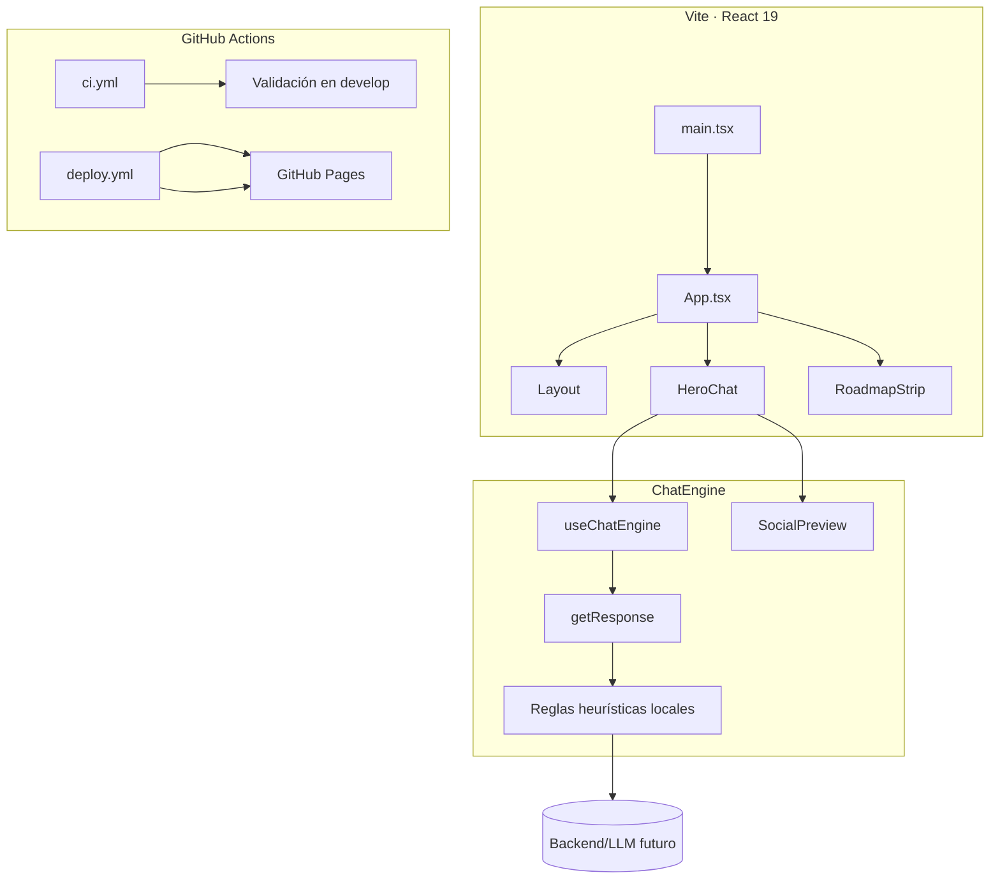

# Arquitectura de indevelops UI

## Capas principales
- **Presentación:** componentes React (`HeroChat`, `ChatInput`, `SocialPreview`, `RoadmapStrip`) que construyen el home hero retro.
- **Estado del chat:** hook `useChatEngine` maneja historial, latencia simulada y delega respuestas en `utils/responses`.
- **Motor de respuestas:** heurísticas locales generan mensajes de texto y previews sociales, con rutas claras para conectar un backend en iteraciones posteriores.
- **Automatización:** workflows de GitHub Actions (`ci.yml`, `deploy.yml`) integran Git Flow (`develop` → `master`) y publican en GitHub Pages.

## Dependencias relevantes
- React 19 + Vite 7 (con TypeScript).
- CSS Modules y design tokens en `src/styles/global.css`.
- `gh-pages` para despliegue manual (opcional) y Actions oficiales para despliegue automático.

Mantén este documento actualizado al introducir nuevos servicios, integraciones o cambios estructurales.
