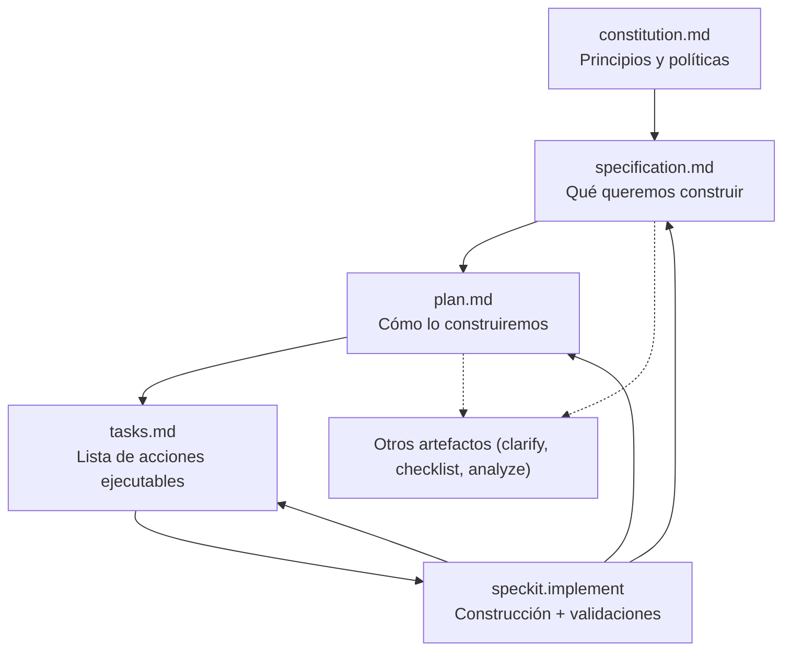

# Flujo Spec Kit en indevelops UI

## Artefactos
- `constitution.md`: principios del proyecto (diseño, automatización, calidad).
- `specification.md`: describe la experiencia del home y el alcance del chat funcional.
- `plan.md`: decisiones técnicas (React/Vite, componentes, estilos, despliegue).
- `tasks.md`: checklist por fases para ejecutar la implementación.
- `memory/` extra: otros archivos generados por comandos (p. ej. clarifications, checklists).

Todos se encuentran en `.specify/memory/` y se versionan junto con el código.

## Diagrama general

### Orden recomendado
1. **Constitución:** establece o ajusta principios cuando cambia la forma de trabajar.
2. **Especificación:** captura intención, UX y alcance.
3. **Plan:** concreta arquitectura, componentes y validaciones.
4. **Tasks:** desglosa el plan en pasos ejecutables.
5. **Implementación:** ejecuta `/speckit.implement`, valida build/tests y documenta cambios.
6. **Retroalimentación:** si surgen nuevos hallazgos, vuelve a especificación/plan y actualiza tasks.

## Ciclo por feature
1. **Constitución (si aplica):** ajusta principios cuando cambien normas o políticas.
2. **/speckit.specify:** redacta qué se construirá (UX, contenidos, fuera de alcance).
3. **/speckit.plan:** traduce la especificación al plan técnico.
4. **/speckit.tasks:** genera la lista de tareas ordenadas.
5. **/speckit.implement:** ejecuta las tareas y valida con tests/builds.

## Recomendaciones
- Cada pull request debe indicar qué artefactos actualizó.
- Mantén sincronizados los enlaces entre `docs/` y los archivos de Spec Kit para evitar divergencias.
- Para features grandes, considera añadir `/speckit.clarify`, `/speckit.checklist` o `/speckit.analyze` como pasos adicionales.
